# Adesua

Adesua is a video course marketplace, built as our TS Academy full-stack capstone project (topic 56). Instructors publish video courses. Students enroll in free courses or buy paid ones through a demo checkout, then watch the lessons and track their progress. Admins manage users and categories.

> **Status: The MVP is complete and live.** Visit the [live site](https://adesua-course-marketplace.vercel.app) or the [live API](https://adesua-api.onrender.com/api/health).

## Features by role

- **Visitors**
  - See popular courses, live platform totals and skill shortcuts on Home
  - Browse published courses, search by title, filter by category, level and price (free or paid), and sort by newest, most popular or price
  - Open a course to see its details, its lesson outline and any free preview lessons
- **Students**
  - Sign up and log in
  - Enroll in free courses, or buy paid courses through the demo checkout
  - Watch lessons, mark them complete and track progress in My learning
  - See their purchase history
- **Instructors**
  - Create courses (they start as drafts), and add, edit and delete lessons with a YouTube video, notes, or both
  - Publish or unpublish their courses
  - See their students and earnings
- **Admins**
  - See platform totals
  - Search users, filter them by role, and deactivate or reactivate accounts
  - Create, rename and delete categories
  - Search and filter all courses, including drafts; unpublish published courses and delete courses with no students

## Tech stack

- React with Vite for the frontend (in `frontend/`)
- Node.js, Express 5 and MongoDB Atlas with Mongoose 9 for the backend
- JSON Web Tokens (jsonwebtoken) for login, and bcryptjs for password hashing
- helmet, cors, express-rate-limit and express-validator for security and validation
- Jest and Supertest for testing

We also use Git and GitHub, Postman and Prettier.

## Getting started

### Prerequisites

- Node.js 20.19 or newer (Mongoose 9 needs at least 20.19)
- Git
- A MongoDB Atlas connection string (ask the project lead)

```
git clone https://github.com/PROSPER-N/adesua-course-marketplace.git
cd adesua-course-marketplace
```

### Backend

```
cd backend
npm install
cp .env.example .env
```

On Windows PowerShell, use `Copy-Item .env.example .env` instead of `cp`.

Then fill in these three lines in `backend/.env` (the others already have working values):

| Variable | What to put |
|---|---|
| `MONGO_URI` | Your Atlas connection string, with the database name `adesua_dev_<your name>` |
| `MONGO_URI_TEST` | The same string, with the database name `adesua_test_<your name>` |
| `JWT_SECRET` | A long random string. Make one with `node -e "console.log(require('crypto').randomBytes(64).toString('hex'))"` |

Add demo data and start the server:

```
npm run seed -- --yes
npm run dev
```

The API runs at http://localhost:5000/api. Check http://localhost:5000/api/health to see if it's up.

### Frontend

```
cd frontend
npm install
cp .env.example .env
npm run dev
```

The app opens at http://localhost:5173.

## Test accounts

`npm run seed -- --yes` creates these accounts. **Every account uses the password `Demo1234`.**

| Name | Email | Role |
|---|---|---|
| Admin User | admin@example.com | admin |
| Kwame Asante | kwame@example.com | instructor |
| Ama Owusu | ama@example.com | instructor |
| Akosua Mensah | akosua@example.com | student |
| Kojo Ansah | kojo@example.com | student |
| Esi Nyarko | esi@example.com | student |

## Screenshots

These screenshots were captured from the live site. At the time of capture, the production API had no published courses or student enrollments. The course-details and lesson-player images show the unavailable state; no production content was created or changed to obtain screenshots.

| Screen | 1280px | 390px |
|---|---|---|
| Home | 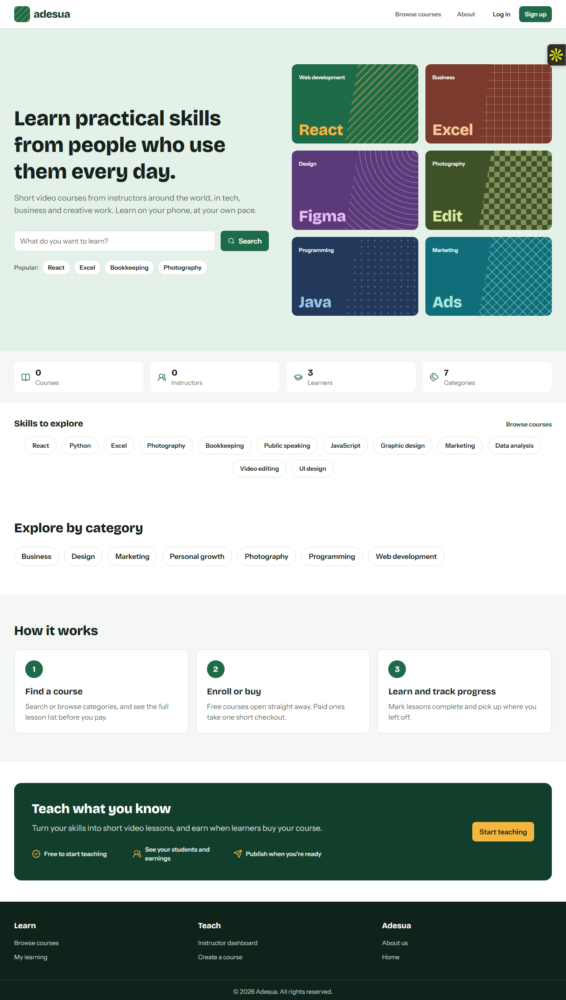 | 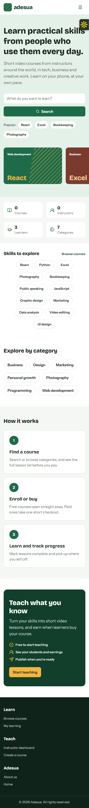 |
| Browse courses | 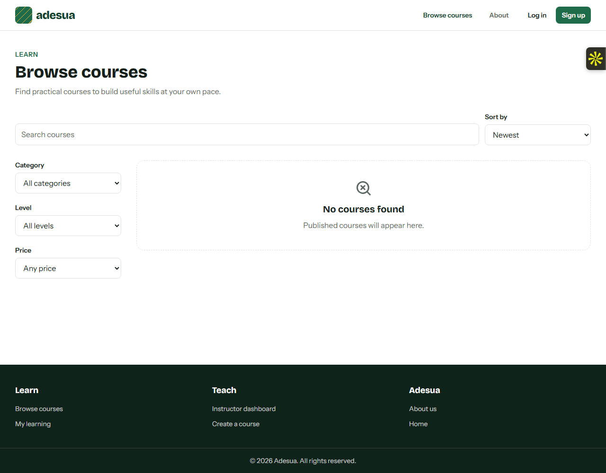 | 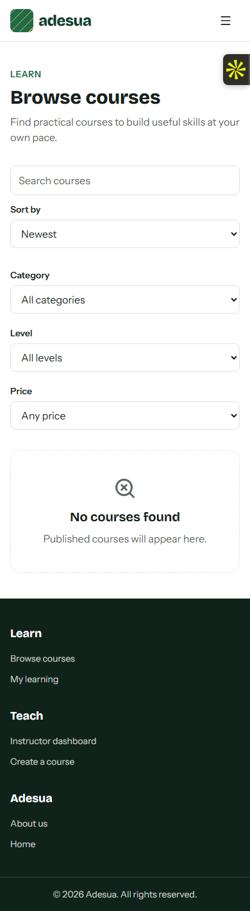 |
| Course details | 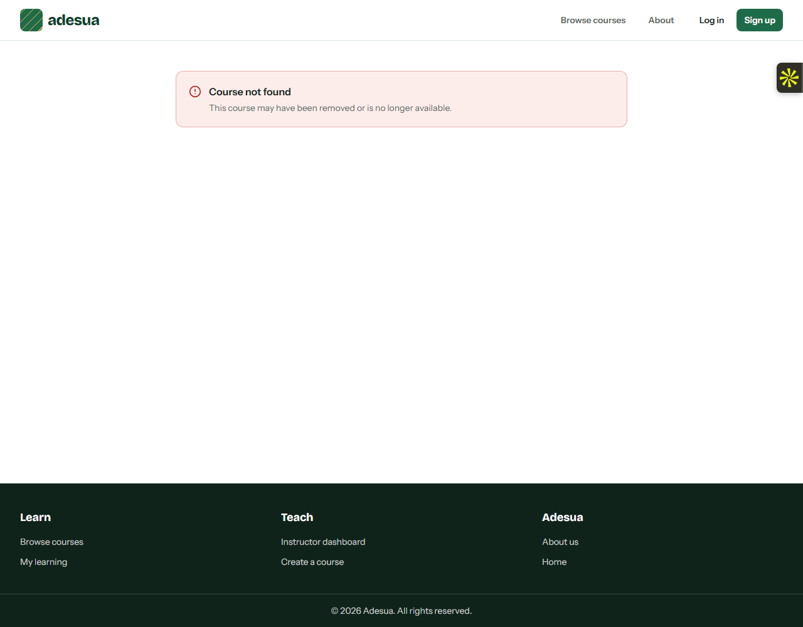 | — |
| Lesson player | 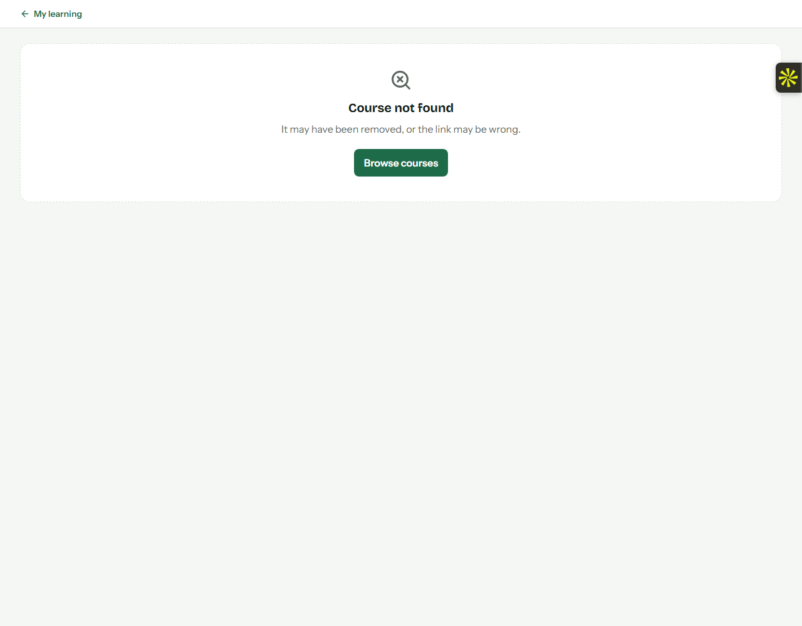 | — |
| My learning | 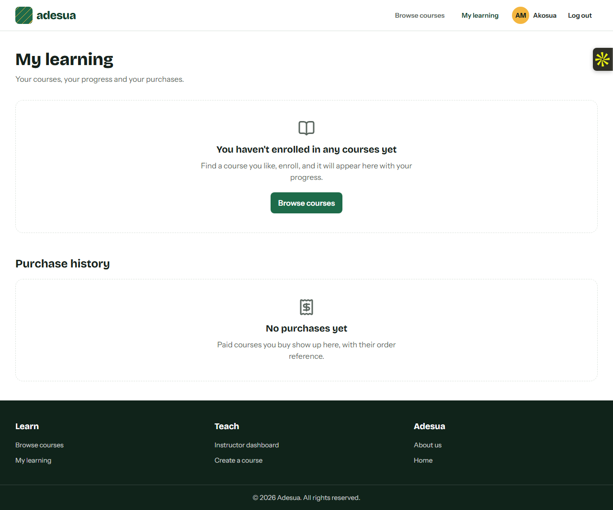 | — |
| Instructor dashboard | 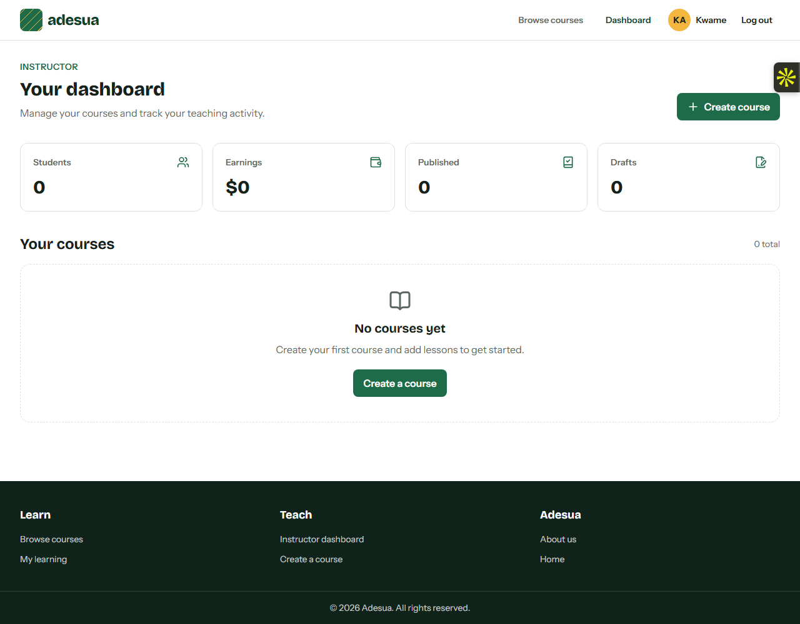 | — |
| Admin users | 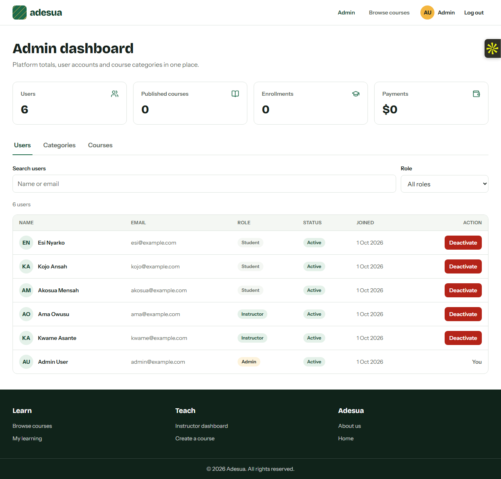 | — |
| Admin categories | 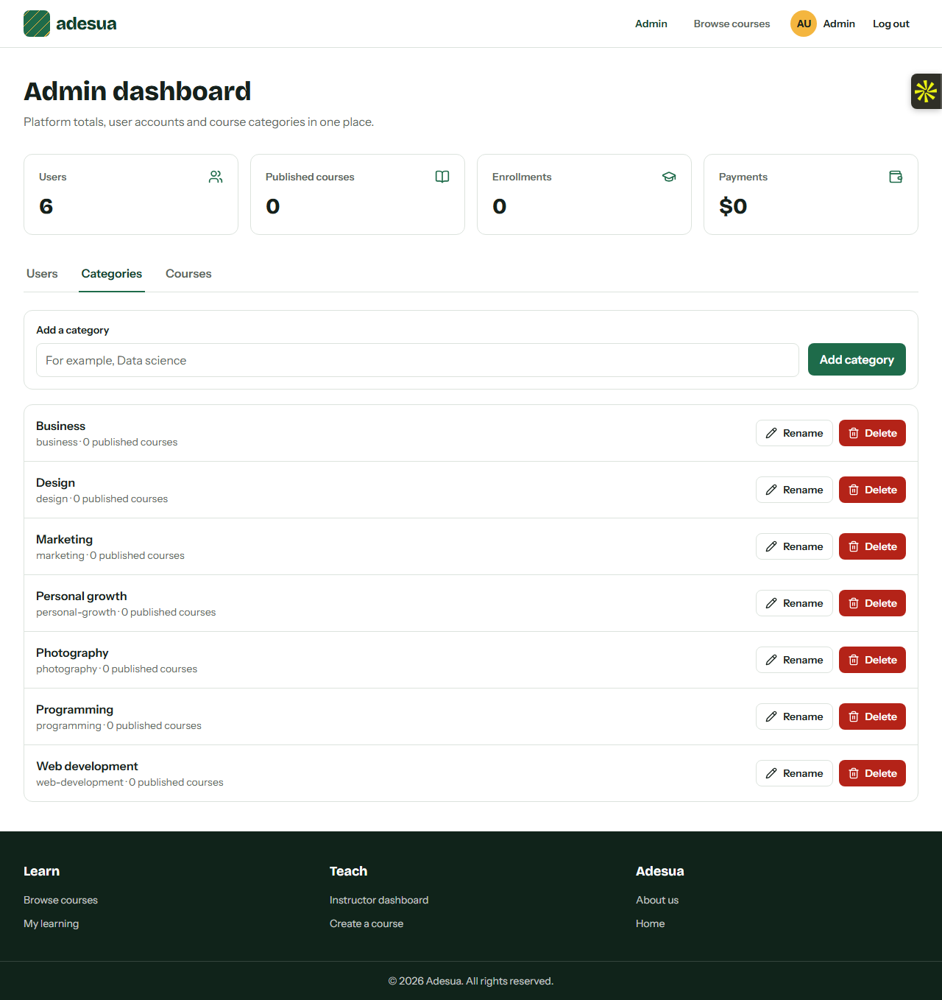 | — |
| Admin courses | 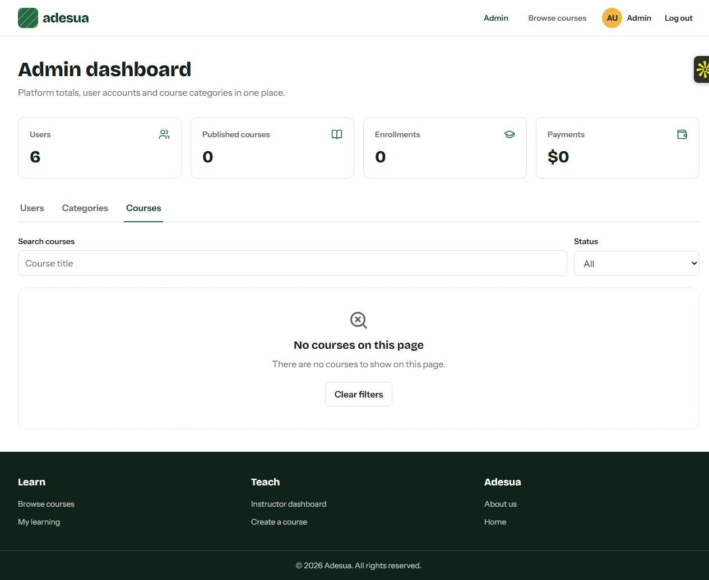 | — |

## Scripts

Run these inside `backend/`:

| Command | What it does |
|---|---|
| `npm run dev` | Starts the API and restarts it when you save a file (nodemon) |
| `npm start` | Starts the API without restarting |
| `npm run seed -- --yes` | Deletes everything in your dev database and adds the demo data |
| `npm run seed:production -- --yes` | Resets the production database to the demo data. Read [docs/DEPLOYMENT.md](docs/DEPLOYMENT.md) first |
| `npm test` | Runs the Jest tests against your test database |

Frontend scripts are in `frontend/package.json` (`npm run dev` starts the app).

## Project structure

```
Adesua/
├── backend/
│   ├── server.js            starts the server
│   ├── src/
│   │   ├── app.js           builds the Express app (middleware and routes)
│   │   ├── config/          database connection
│   │   ├── controllers/     what each endpoint does
│   │   ├── middleware/      login checks, validation, errors, rate limit
│   │   ├── models/          Mongoose models
│   │   ├── routes/          one route file per feature, all mounted in routes/index.js
│   │   ├── services/        shared business logic
│   │   ├── utils/           small helpers (responses, errors, pagination, tokens)
│   │   └── validators/      express-validator rules
│   ├── seed/                demo data script
│   ├── tests/               Jest tests and helpers
│   └── .env.example
├── frontend/                React app
├── docs/
│   ├── API_CONTRACT.md      every endpoint, response and message
│   ├── CONVENTIONS.md       how we work together
│   └── DEPLOYMENT.md        how the API goes live on Render and the site on Vercel
└── .github/
    ├── workflows/
    │   └── tests.yml        runs the tests on every pull request
    └── pull_request_template.md
```

## API docs

- API contract: [docs/API_CONTRACT.md](docs/API_CONTRACT.md)
- Postman: in Postman choose **Import** and pick the files in [docs/postman/](docs/postman/), select the **Adesua local** environment, then run **Auth > Log in** first.
- Live API: https://adesua-api.onrender.com/api/health
- Live site: https://adesua-course-marketplace.vercel.app

## Team

| Member | Name | GitHub | Responsible for |
|---|---|---|---|
| Member A (project lead) | PROSPER NGWOKE | [PROSPER-N](https://github.com/PROSPER-N) | Repo setup, backend foundation, login API, categories, admin, team docs |
| Member B | FOLAKEMI ELIZABETH OKEOWO | [CoderLizzy](https://github.com/CoderLizzy) | Frontend foundation, course and lesson models, courses, lessons, instructor dashboard |
| Member C | VICTOR C.U BENNETH | [Arch-host](https://github.com/Arch-host) | Order and enrollment models, connecting the frontend to the backend, checkout, learning and progress, instructor stats |

## Known limitations

- The demo checkout takes no real payments. "Paying" just marks the order as paid and enrolls the student.
- The login token is stored in the browser's localStorage. That's simple, but a script injected into the page could read it. A production app would use an httpOnly cookie instead.
- The free API may sleep after idle time. Its first request after sleeping can take up to a minute while it wakes.
- The live demo currently has no published courses or student enrollments, so course details and the lesson player cannot be demonstrated until demo course data is restored.
