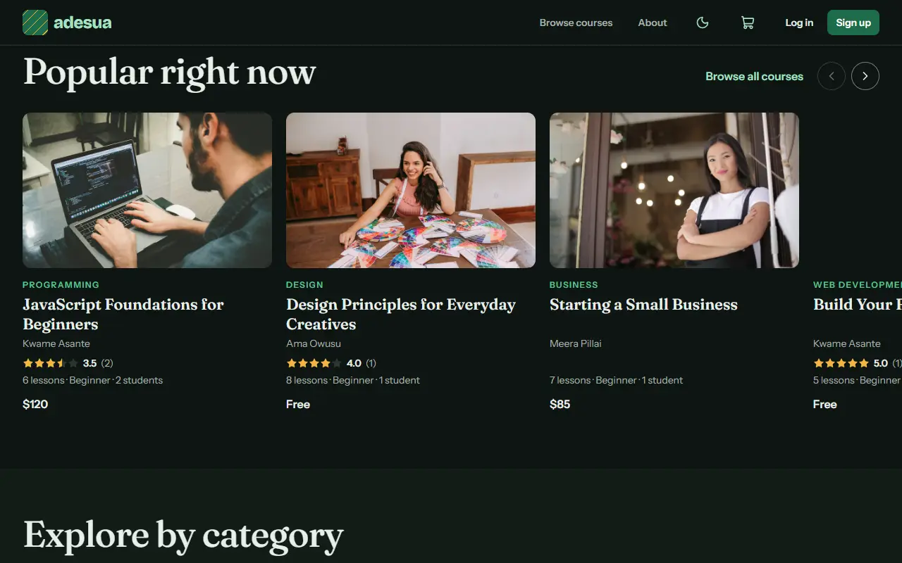
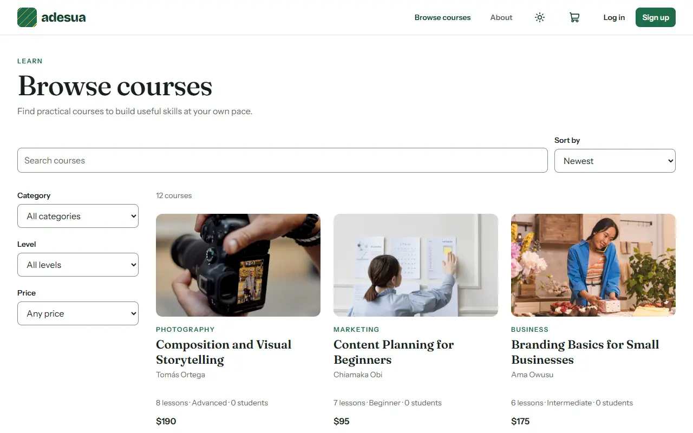
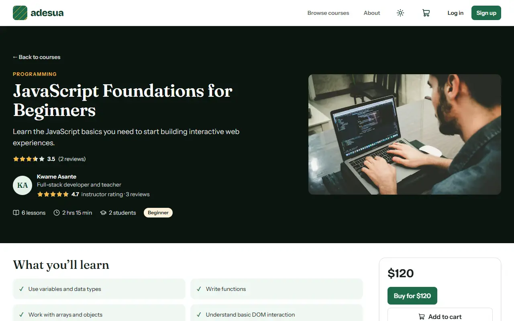
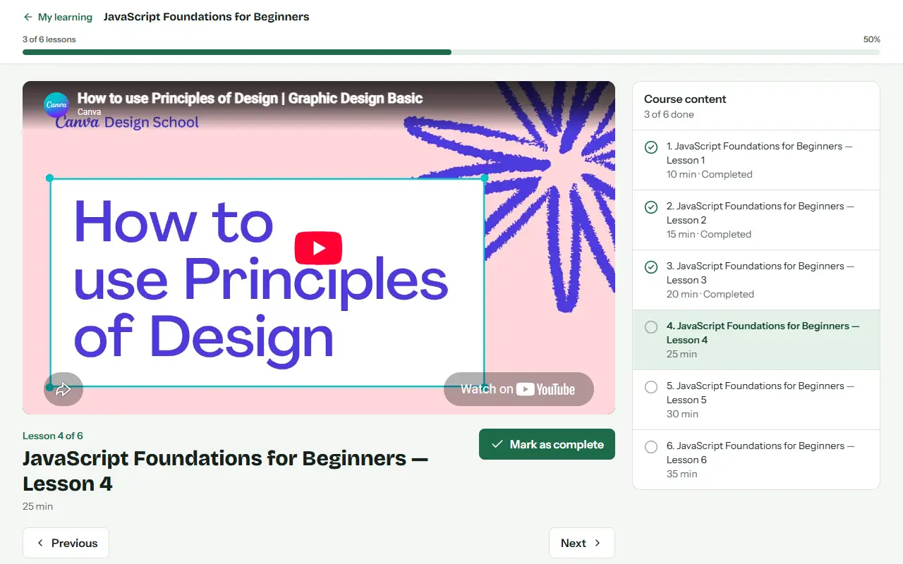
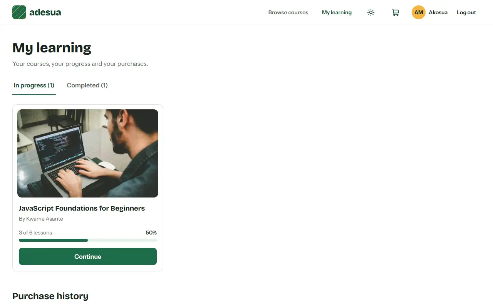
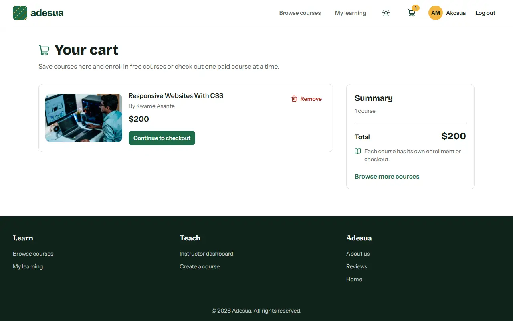
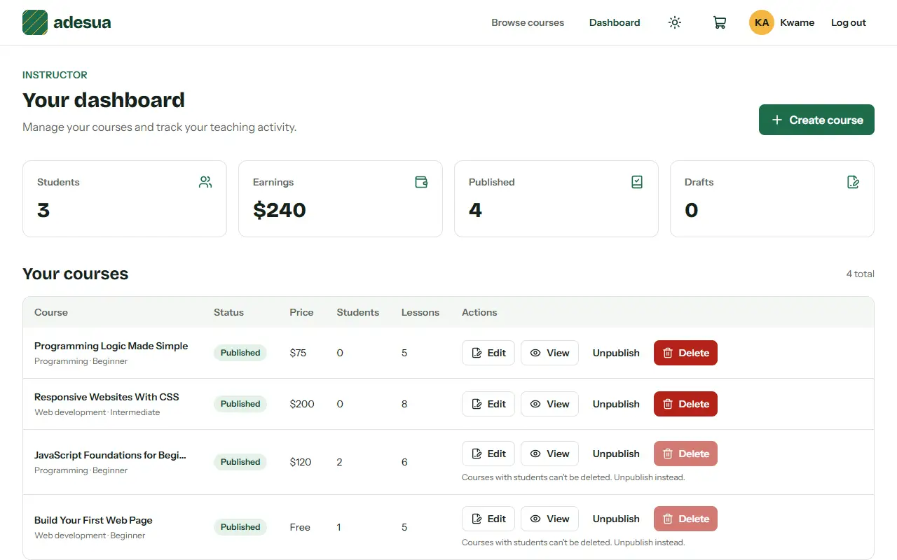
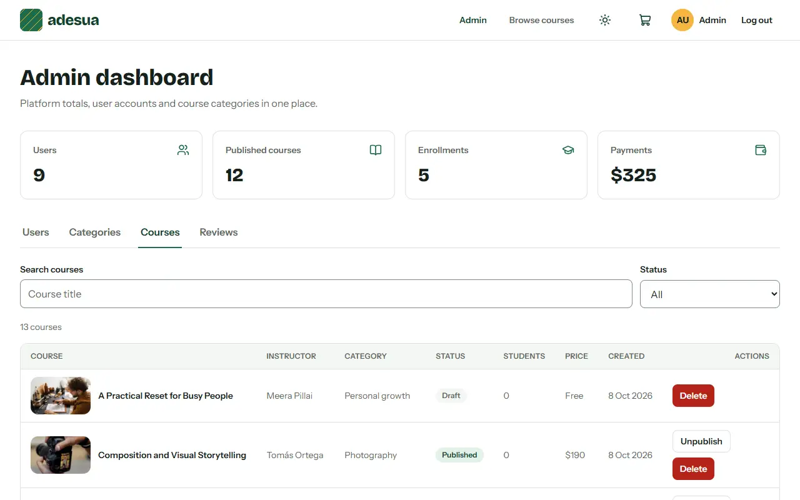
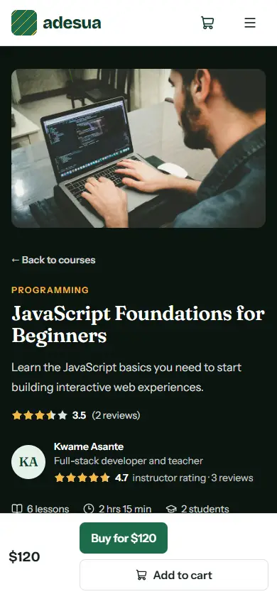

# Adesua

Adesua is a video course marketplace, built as our TS Academy full-stack capstone project (topic 56). Instructors publish video courses. Students enroll in free courses or buy paid ones through a demo checkout, then watch the lessons and track their progress. Admins manage users, categories and courses.

> **Status: The MVP is complete and live.** Visit the [live site](https://adesua-course-marketplace.vercel.app) or the [live API](https://adesua-api.onrender.com/api/health).

## Features by role

- **Visitors**
  - See Home: a short video, live platform totals that refresh every 30 seconds, popular courses, categories, the instructors with their ratings, and recent reviews
  - Switch between light, dark and system themes (this works for everyone)
  - Show prices in US dollars, Nigerian naira, British pounds, euros, Ghanaian cedis, South African rand or Indian rupees. Prices in other currencies are estimates, using fixed rates from 7 October 2026. Checkout charges in US dollars, and it's a demo with no real payment.
  - Save courses to a browser cart before signing in
  - Browse published courses, search by title, filter by category, level and price (free or paid), and sort by newest, most popular or price
  - Open a course to see its photo, details, instructor, ratings, reviews, lesson outline and any free preview lessons
  - Read every platform review on the Reviews page
- **Students**
  - Sign up and log in, and pick up to five interests when signing up
  - Enroll in free courses, or buy paid courses through the demo checkout
  - Watch lessons, mark them complete and track progress in My learning
  - Rate and review the courses they're enrolled in, with one rating for the course and one for the instructor
  - Write a review of Adesua
  - See their purchase history
- **Instructors**
  - Sign up with a headline and a teaching area, which show in the instructors section on Home
  - Create courses (they start as drafts), and add, edit and delete lessons with a YouTube video, notes, or both
  - Publish or unpublish their courses
  - See their students and earnings
  - Write a review of Adesua
- **Admins**
  - See platform totals
  - Search users, filter them by role, and deactivate or reactivate accounts
  - Create, rename and delete categories
  - Search and filter all courses, including drafts; unpublish published courses and delete courses with no students
  - Hide or show course and platform reviews

## Tech stack

- React with Vite for the frontend (in `frontend/`)
- Tailwind CSS 4, React Router, Axios, lucide-react icons and react-hot-toast in the frontend, checked with oxlint
- Node.js, Express 5 and MongoDB Atlas with Mongoose 9 for the backend
- JSON Web Tokens (jsonwebtoken) for login, and bcryptjs for password hashing
- helmet, cors, express-rate-limit and express-validator for security and validation
- Jest and Supertest for testing

We also use Git and GitHub, Postman and Prettier.

## Getting started

### Prerequisites

- Node.js 20.19 or newer (Mongoose 9 needs at least 20.19)
- Git
- A MongoDB Atlas connection string (ask the project lead)

```
git clone https://github.com/PROSPER-N/adesua-course-marketplace.git
cd adesua-course-marketplace
```

### Backend

```
cd backend
npm install
cp .env.example .env
```

On Windows PowerShell, use `Copy-Item .env.example .env` instead of `cp`.

Then fill in these three lines in `backend/.env` (the others already have working values):

| Variable | What to put |
|---|---|
| `MONGO_URI` | Your Atlas connection string, with the database name `adesua_dev_<your name>` |
| `MONGO_URI_TEST` | The same string, with the database name `adesua_test_<your name>` |
| `JWT_SECRET` | A long random string. Make one with `node -e "console.log(require('crypto').randomBytes(64).toString('hex'))"` |

Add demo data and start the server:

```
npm run seed -- --yes
npm run dev
```

The API runs at http://localhost:5000/api. Check http://localhost:5000/api/health to see if it's up.

### Frontend

```
cd frontend
npm install
cp .env.example .env
npm run dev
```

The app opens at http://localhost:5173.

## Test accounts

`npm run seed -- --yes` creates these accounts. **Every account uses the password `Demo1234`.** The seed also adds 12 published courses and 1 draft, and enrolls the students at different stages: Akosua Mensah has finished a free course and is halfway through a paid one, Kojo Ansah has started a free course and bought a paid one, and Esi Nyarko has finished a paid course. It also adds 7 reviews: 4 course reviews from the students and 3 platform reviews.

| Name | Email | Role |
|---|---|---|
| Admin User | admin@example.com | admin |
| Kwame Asante | kwame@example.com | instructor |
| Ama Owusu | ama@example.com | instructor |
| Chiamaka Obi | chiamaka@example.com | instructor |
| Tomás Ortega | tomas@example.com | instructor |
| Meera Pillai | meera@example.com | instructor |
| Akosua Mensah | akosua@example.com | student |
| Kojo Ansah | kojo@example.com | student |
| Esi Nyarko | esi@example.com | student |

## Screenshots

These screenshots were taken on a freshly seeded development database, using the test accounts above. The lesson player, My learning and the cart show Akosua Mensah's account, and the instructor dashboard shows Kwame Asante's.


*Home at 1280px, light theme*

| | |
|---|---|
| <br>Home, dark theme | <br>Browse courses |
| <br>Course page | <br>Lesson player |
| <br>My learning | <br>Cart |
| <br>Instructor dashboard | <br>Admin: courses |
| <br>Home on a phone | <br>Course page on a phone |

## Scripts

Run these inside `backend/`:

| Command | What it does |
|---|---|
| `npm run dev` | Starts the API and restarts it when you save a file (nodemon) |
| `npm start` | Starts the API without restarting |
| `npm run seed` | Shows which database the seed would reset, then stops without changing anything |
| `npm run seed -- --yes` | Deletes everything in your dev database and adds the demo data |
| `npm run seed:production -- --yes` | Resets the production database to the demo data. Read [docs/DEPLOYMENT.md](docs/DEPLOYMENT.md) first |
| `npm test` | Runs the Jest tests against your test database |

Run these inside `frontend/`:

| Command | What it does |
|---|---|
| `npm run dev` | Starts the app at http://localhost:5173 |
| `npm run lint` | Checks the code with oxlint |
| `npm run build` | Builds the app into `dist/` |
| `npm run preview` | Serves the built app locally |
| `npx --yes prettier@3.9.9 --check "src/**/*.{js,jsx,css}" index.html vite.config.js package.json .oxlintrc.json vercel.json` | Checks the formatting, the same way the CI does |

## Project structure

```
Adesua/
├── backend/
│   ├── server.js            starts the server
│   ├── src/
│   │   ├── app.js           builds the Express app (middleware and routes)
│   │   ├── config/          database connection
│   │   ├── controllers/     what each endpoint does
│   │   ├── middleware/      login checks, validation, errors, rate limit
│   │   ├── models/          Mongoose models
│   │   ├── routes/          one route file per feature, all mounted in routes/index.js
│   │   ├── services/        shared business logic
│   │   ├── utils/           small helpers (responses, errors, pagination, tokens)
│   │   └── validators/      express-validator rules
│   ├── seed/                demo data script
│   ├── tests/               Jest tests and helpers
│   └── .env.example
├── frontend/                React app
│   └── public/media/        the Home page video and its poster
├── docs/
│   ├── API_CONTRACT.md      every endpoint, response and message
│   ├── CONVENTIONS.md       how we work together
│   ├── CREDITS.md           where every photo and video comes from
│   ├── DEPLOYMENT.md        how the API goes live on Render and the site on Vercel
│   ├── postman/             Postman collections and environments
│   └── screenshots/         the screenshots in this README
└── .github/
    ├── workflows/
    │   └── tests.yml        runs the tests on every pull request
    └── pull_request_template.md
```

## API overview

The main endpoints. [docs/API_CONTRACT.md](docs/API_CONTRACT.md) lists all of them, with who can use each one, the request bodies, the responses and the messages.

| Method | Path | Purpose |
|---|---|---|
| GET | `/api/health` | API is running |
| GET | `/api/stats` | Published courses, instructors, learners and categories, for Home |
| GET | `/api/instructors` | Active instructors with published courses, with their ratings |
| POST | `/api/auth/register` | Create a student or instructor account |
| POST | `/api/auth/login` | Log in |
| GET | `/api/auth/me` | The logged-in user |
| GET | `/api/categories` | Categories with published-course counts |
| GET | `/api/courses` | Published courses with search, filters, sort and pages |
| GET | `/api/courses/:id` | One published course with its lesson outline |
| GET | `/api/courses/:id/reviews` | A course's visible reviews, with a summary |
| GET | `/api/reviews` | Visible platform reviews, with a summary |
| POST | `/api/courses` | Create a course (it starts as a draft) |
| POST | `/api/enrollments` | Enroll in a free course |
| POST | `/api/orders` | Start the demo checkout for a paid course |
| GET | `/api/courses/:id/lessons` | Full lessons and progress, for enrolled students |
| GET | `/api/instructor/stats` | An instructor's students and earnings |
| GET | `/api/admin/stats` | Platform totals for admins |

## API docs

- API contract: [docs/API_CONTRACT.md](docs/API_CONTRACT.md)
- Postman: in Postman choose **Import** and pick the files in [docs/postman/](docs/postman/), select the **Adesua local** environment, then run **Auth > Log in** first.
- Live API: https://adesua-api.onrender.com/api/health
- Live site: https://adesua-course-marketplace.vercel.app

## Credits

The photos and the Home page video come from Unsplash and Pexels under their free licences. [docs/CREDITS.md](docs/CREDITS.md) lists each one with its creator and source.

## Team

| Member | Name | GitHub | Responsible for |
|---|---|---|---|
| Member A (project lead) | PROSPER NGWOKE | [PROSPER-N](https://github.com/PROSPER-N) | Repo setup, backend foundation, login API, categories, admin, team docs |
| Member B | FOLAKEMI ELIZABETH OKEOWO | [CoderLizzy](https://github.com/CoderLizzy) | Frontend foundation, course and lesson models, courses, lessons, instructor dashboard |
| Member C | VICTOR C.U BENNETH | [Arch-host](https://github.com/Arch-host) | Order and enrollment models, connecting the frontend to the backend, checkout, learning and progress, instructor stats |

## Known limitations

- The demo checkout takes no real payments. "Paying" just marks the order as paid and enrolls the student.
- The login token is stored in the browser's localStorage. That's simple, but a script injected into the page could read it. A production app would use an httpOnly cookie instead.
- The free API may sleep after idle time. Its first request after sleeping can take up to a minute while it wakes.
- The cart is saved in this browser's localStorage and does not sync across devices. Checkout and free enrollment happen one course at a time.
